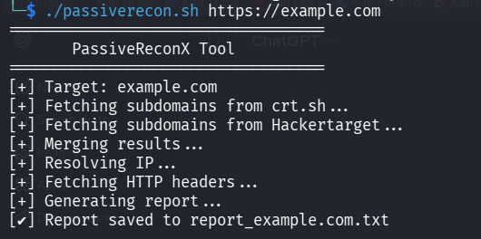
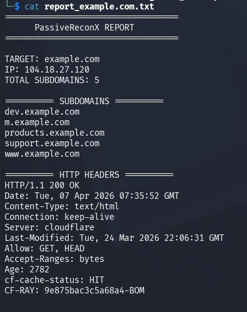

# PassiveReconX

[]()
[]()
[]()
[]()
[](https://github.com/thenullroot)


## 👤 Author

[](https://github.com/thenullroot)  
[](https://www.linkedin.com/in/aniket-nayak-634495317/)

PassiveReconX is a lightweight Bash-based passive reconnaissance tool that gathers intelligence about a target domain using multiple open-source data sources.

---

## 🔍 Features

- 🔎 Passive subdomain enumeration  
- 🌐 Multi-source data collection  
- 🔗 Supports domain & full URL input  
- 🔄 HTTP → HTTPS fallback  
- 📡 IP resolution  
- 🧾 HTTP header extraction  
- 📄 Structured report generation  
- 🔢 Subdomain count included  

---

## 📸 Screenshots

### ▶️ Tool Execution


### 📄 Generated Report


---

## ⚙️ Requirements

Make sure the following tools are installed:

- bash
- curl
- dig

---

## 🚀 Usage

### 1. Clone the repository

```bash
git clone https://github.com/thenullroot/passivereconx.git
cd passivereconx
```

### 2. Make script executable

```bash
chmod +x passiverecon.sh
```

### 3. Run the tool

#### Using domain:
```bash
./passiverecon.sh example.com
```

#### Using full URL:
```bash
./passiverecon.sh https://example.com
```

---

## 📄 Output

### Subdomains file:
```
subdomains_<target>.txt
```

### Full report:
```
report_<target>.txt
```

---

## 📌 Example Output

```
===================================
      PassiveReconX REPORT
===================================

TARGET: example.com
IP: 104.x.x.x
TOTAL SUBDOMAINS: 5

========== SUBDOMAINS ==========
dev.example.com
m.example.com
products.example.com
support.example.com
www.example.com

========== HTTP HEADERS ==========
HTTP/1.1 200 OK
Server: cloudflare
Content-Type: text/html
```

---

## ⚠️ Disclaimer

This tool is intended for educational purposes and authorized security testing only.  
Do not use this tool against targets without proper permission.

---

## 🛠️ Future Improvements

- Shodan integration
- Censys integration
- ASN and IP intelligence
- Subdomain takeover detection
- Output formatting improvements

---

#### GitHub: https://github.com/thenullroot

#### LinkedIn: https://www.linkedin.com/in/aniket-nayak-634495317/

## ⭐ Contributing

Feel free to fork the repository and submit pull requests.

---

## 📜 License

This project is open-source and available under the MIT License.
